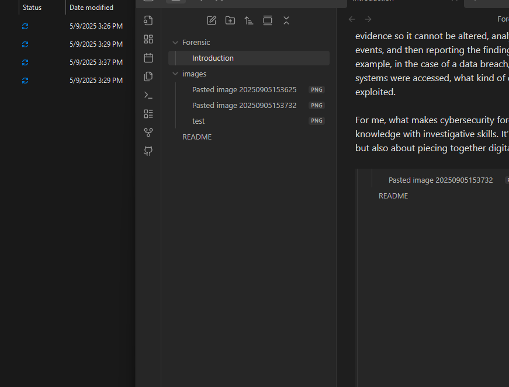

Forensic in cybersecurity is about investigating and analyzing digital evidence after a cyber incident happens. I see it as the process of digging into computers, networks, or digital devices to understand what really happened, how it happened, and who might be responsible. Unlike regular troubleshooting, forensic work needs to be very detailed and systematic, because the evidence collected can sometimes be used in legal cases.

The main steps usually include identifying that an incident occurred, preserving the evidence so it cannot be altered, analyzing the data to uncover the timeline of events, and then reporting the findings in a way that is clear and structured. For example, in the case of a data breach, digital forensics can help figure out which systems were accessed, what kind of data was taken, and which vulnerabilities were exploited.

For me, what makes cybersecurity forensics interesting is that it combines technical knowledge with investigative skills. It’s not just about defending systems in real-time, but also about piecing together digital clues to reveal the bigger picture of an attack.

